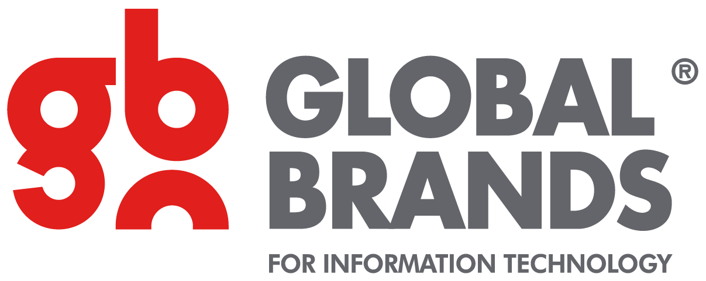

<p align="center">
  
</p>

# Multi-Cloud Training Program – Global Brands Group (GBG)

Welcome to the **GBG Multi-Cloud Training** repository. This program is designed to equip engineers, developers, and IT professionals with hands-on expertise across major cloud provider ecosystems, including AWS, Microsoft Azure, and Google Cloud Platform (GCP).

---

## 📌 Overview

Global Brands Group (GBG) provides comprehensive training on modern cloud architecture, cloud-native deployments, and multi-cloud management strategies. This repository contains practice labs, task assignments, configuration files, and documentation related to the training modules.

---

## 🎯 Program Objectives

- **Cloud Foundations:** Master basic to advanced cloud concepts, infrastructure, and storage systems across AWS, Azure, and GCP.
- **Multi-Cloud Architecture:** Learn best practices for designing scalable, high-availability, and fault-tolerant cloud environments across multiple cloud providers.
- **DevOps & Automation:** Automate cloud infrastructure using Infrastructure as Code (IaC) tools like **Terraform** and **Ansible**.
- **Cloud Security & Compliance:** Implement unified security, identity management, and compliance frameworks across cloud networks.
- **Containerization & Orchestration:** Deploy and manage microservices using **Docker** and **Kubernetes** across cloud platforms.

---

## 📚 Training Curriculum

| Module | Topic | Core Tools & Technologies |
| :--- | :--- | :--- |
| **Module 1** | Cloud Architecture & Provider Basics | AWS, Azure, GCP Overview |
| **Module 2** | Networking & Virtual Machines | VPCs, VNets, Subnets, Firewalls, Load Balancers |
| **Module 3** | Infrastructure as Code (IaC) | Terraform, CloudFormation, ARM Templates |
| **Module 4** | Containers & Orchestration | Docker, Amazon EKS, Azure AKS, GCP GKE |
| **Module 5** | CI/CD & DevOps Automation | GitHub Actions, GitLab CI/CD, Azure DevOps |
| **Module 6** | Security, Monitoring & Cost Optimization | AWS CloudWatch, Azure Monitor, IAM, FinOps |

---

## 🚀 Getting Started

### Prerequisites

Ensure you have the following installed on your local development machine:

1. [Git](https://git-scm.com/)
2. [Terraform](https://www.terraform.io/)
3. [AWS CLI](https://aws.amazon.com/cli/) / [Azure CLI](https://docs.microsoft.com/en-us/cli/azure/) / [Google Cloud SDK](https://cloud.google.com/sdk)
4. [Docker Desktop](https://www.docker.com/products/docker-desktop/)

### Quick Start

1. **Clone the repository:**
   ```bash
   git clone https://github.com/marwa-elzoghby/GBG-training.git
   cd GBG-training
   ```

2. **Explore Module Tasks:**
   Navigate into specific task folders to view exercise requirements and starter scripts.

---

## 📁 Repository Structure

```text
GBG-Training/
├── GBG.png                  # Company Logo
├── README.md                # Repository documentation
├── Task1/                   # Git & Multi-Cloud Setup
├── Task2/                   # Infrastructure as Code (Terraform)
├── Task3/                   # Containerization & Kubernetes
└── Docs/                    # Reference guides & training notes
```

---

## 🤝 Guidelines & Best Practices

- Always pull the latest code before pushing changes: `git pull origin main`
- Never commit cloud access keys, passwords, or secret credentials to the repository.
- Use `.gitignore` to exclude sensitive files, state files (`*.tfstate`), and temporary build outputs.

---

## 👤 Author & Contact

- **Trainee:** Marwa Elzoghby
- **Company:** Global Brands Group (GBG)# GBG-training
Tasks done by me through training
