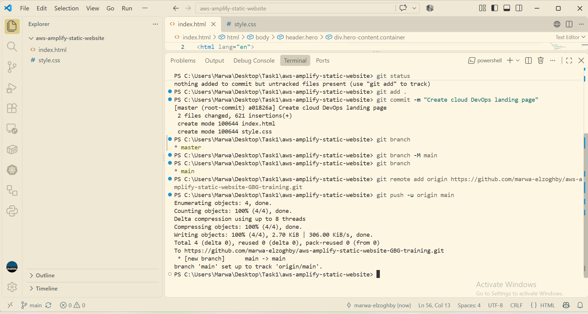
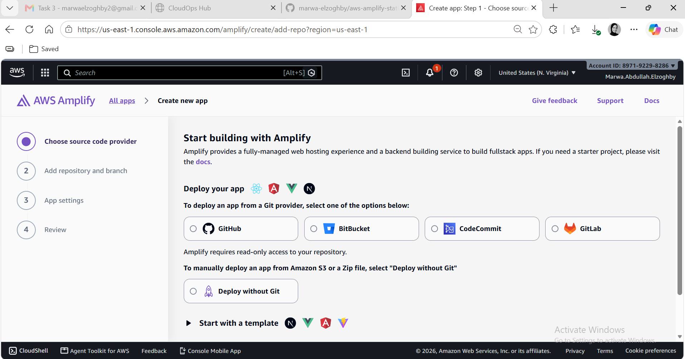
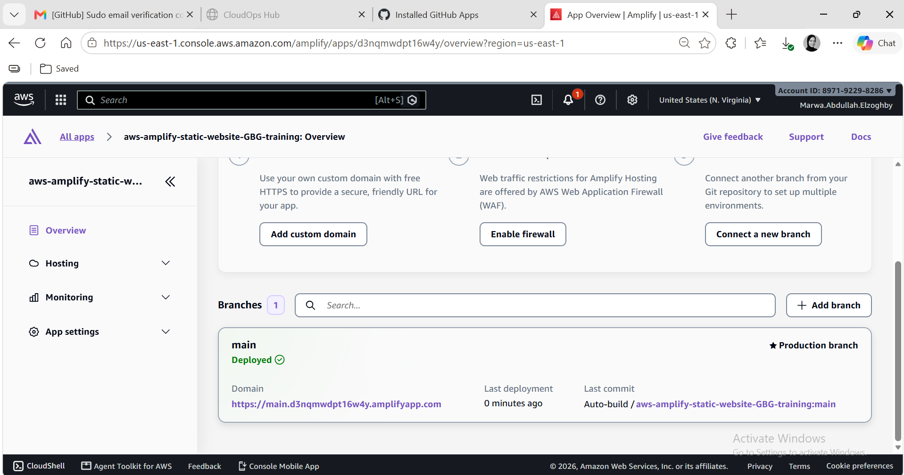
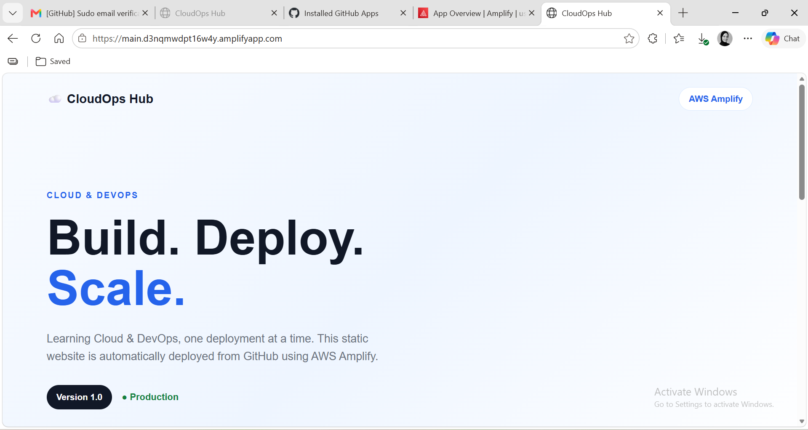
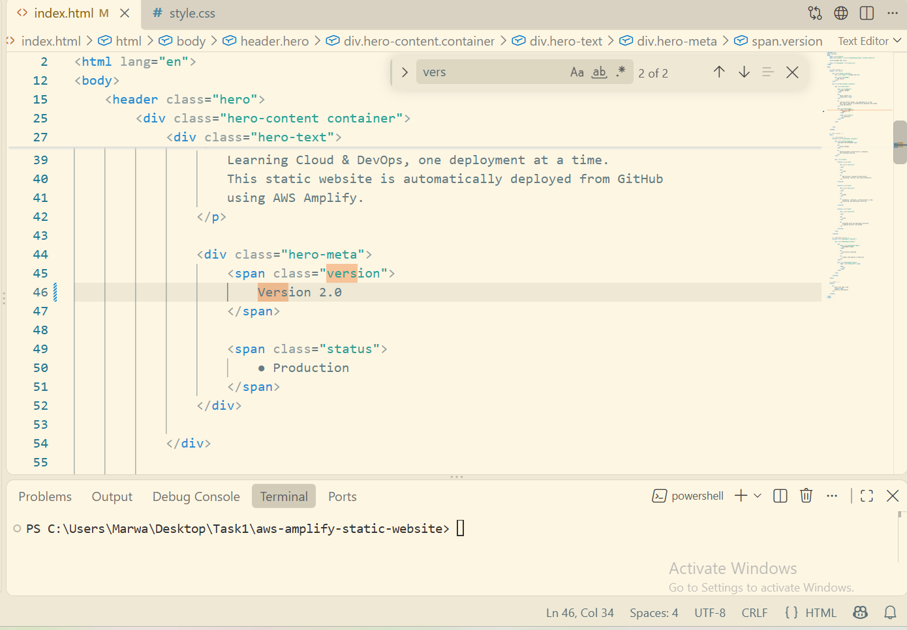
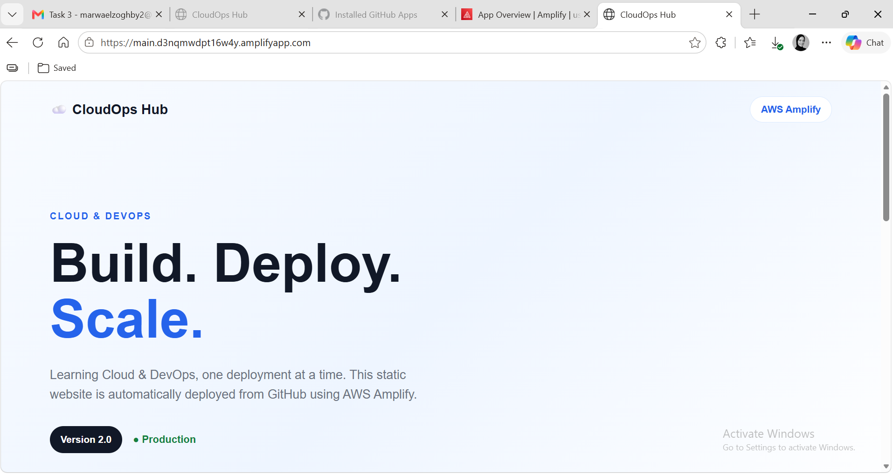
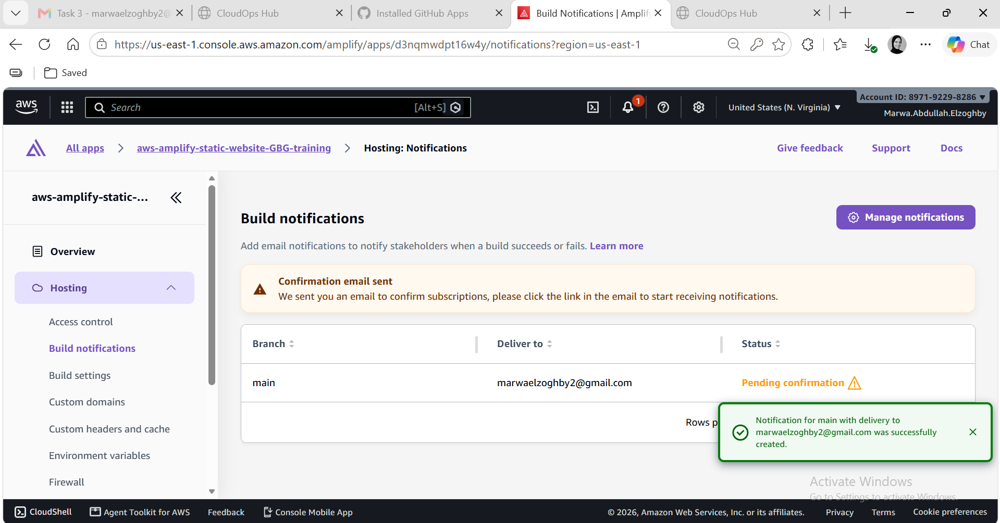
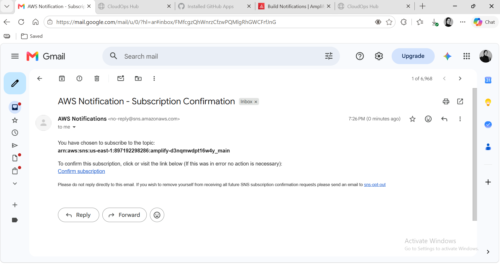
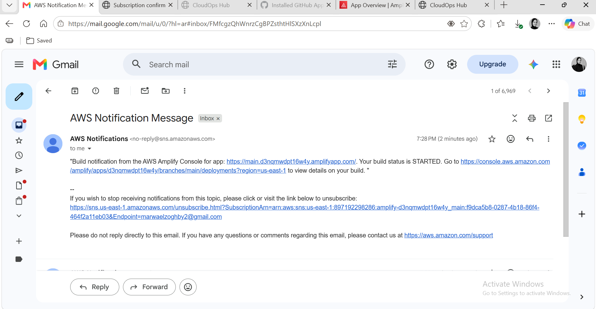
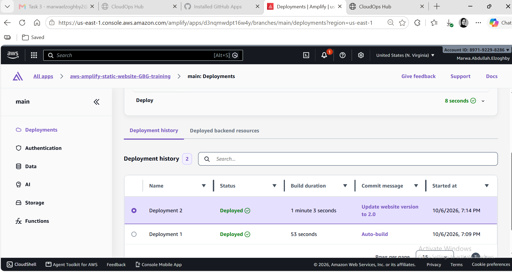

# ☁️ AWS Amplify Static Website Deployment & CI/CD Pipeline

## 📌 Project Overview
This project demonstrates the process of building, deploying, and hosting a modern, responsive **Cloud & DevOps Landing Page** using **HTML5**, **CSS3**, **GitHub**, and **AWS Amplify**. 

The setup establishes a continuous integration and continuous deployment (**CI/CD**) pipeline where any commit pushed to the GitHub `main` branch automatically triggers a build and deployment on AWS Amplify with standard HTTPS encryption. Additionally, deployment notifications via email were configured to provide operational visibility.

---

## 🎯 Key Capabilities Demonstrated
- 🌐 **Static Website Hosting:** Clean HTML & CSS execution deployed to AWS Infrastructure.
- 🔄 **GitHub & AWS Integration:** Automated CI/CD build triggering on commit push.
- 🔒 **Security:** Default SSL/TLS (HTTPS) encryption out-of-the-box.
- 📜 **Deployment Tracking & History:** Rollback and recovery verification.
- 📧 **Automated Notifications:** Real-time email alerts upon build/deployment events.

---

## 🛠️ Step-by-Step Implementation

### Step 1: Local Website Cleanup & Verification
The initial website structure was refined by removing unnecessary SVG asset dependencies to focus purely on a modern typography-driven layout for the Cloud/DevOps landing page.

1. Cleaned up `index.html` structure by removing unused broken asset references.
2. Verified local styling in `style.css`.
3. Tested locally in the browser to ensure responsiveness and layout integrity.

---

### Step 2: Version Control Setup (Git & GitHub)
The local project folder was initialized as a Git repository and pushed to GitHub to serve as the source control provider.

```bash
# Initialize local repository
git init

# Stage all files
git add .

# Create initial commit
git commit -m "Create cloud DevOps landing page"

# Rename branch to main
git branch -M main

# Link remote repository and push code
git remote add origin https://github.com/YOUR_USERNAME/YOUR_REPO.git
git push -u origin main
```

📸 
> *Insert a screenshot showing your GitHub repository with `index.html` and `style.css` committed.*

---

### Step 3: AWS Amplify Setup & Deployment
1. Logged into the **AWS Management Console** and navigated to **AWS Amplify**.
2. Selected **Host web app** and chose **GitHub** as the source code provider.
3. Authorized AWS Amplify to access the GitHub repository and selected the `main` branch.
4. Preserved standard build settings and initiated the initial deployment.

📸 
> *Insert a screenshot of the initial AWS Amplify setup screen selecting GitHub.*

📸 
> *Insert a screenshot showing the AWS Amplify dashboard with green checkmarks for Provision, Build, Deploy, and Verify.*

---

### Step 4: Verification & Live Site Inspection
Once deployment completed, AWS Amplify generated a secure default domain URL (`https://xxx.amplifyapp.com`).

- Verified page render, font loading, and responsiveness.
- Confirmed valid SSL/TLS certificate (HTTPS enforcement).

📸
> *Insert a browser screenshot showing the live website running on the AWS Amplify domain.*

### Automated Deployment Workflow

1. **Local Commit & Version Update**
   - Implemented `version 2` code changes locally.
   - Committed changes and executed `git push` to the remote repository.

2. **Triggered CI/CD Pipeline**
   - The push event automatically triggered the automated deployment process (via GitHub Actions / GitLab CI / hosting integration).

3. **Production Deployment**
   - Build and deployment completed successfully.
   - The live website was updated automatically to reflect **Version 2**.



---

### Step 5: Automated Email Deployment Notifications (Additional Feature)
To improve DevOps observability, automated deployment notifications were configured within AWS Amplify.

#### 🔄 Notification Flow
```
GitHub Push ➔ AWS Amplify ➔ Build & Deploy ➔ Deployment Event ➔ 📧 Email Notification
```

#### Verification Steps:
1. Configured build notifications under **App settings > Notifications** in the AWS Amplify Console.
2. Subscribed an email address to receive build status updates.
3. Triggered a test deployment by making a small edit to `index.html` and pushing to `main`.
4. Verified receipt of the automated notification email.

📸 

> *Insert a screenshot showing the AWS Amplify notification configuration page.*

📸 
> *Insert a screenshot of the email received upon successful deployment.*

---

### Step 6: Rollback & Continuous Deployment Test
1. Verified automatic CI/CD functionality by pushing code updates.
2. Verified build logs in the AWS Amplify Console.
3. Validated rollback/recovery options within the deployment history.

📸 
> *Insert a screenshot showing the deployment history timeline in AWS Amplify.*

---

## 📑 Conclusion
The application was successfully deployed to AWS Amplify with continuous deployment active from GitHub. Beyond standard static hosting requirements, **automated email deployment notifications** were configured and verified, ensuring complete lifecycle management for modern DevOps workflows.